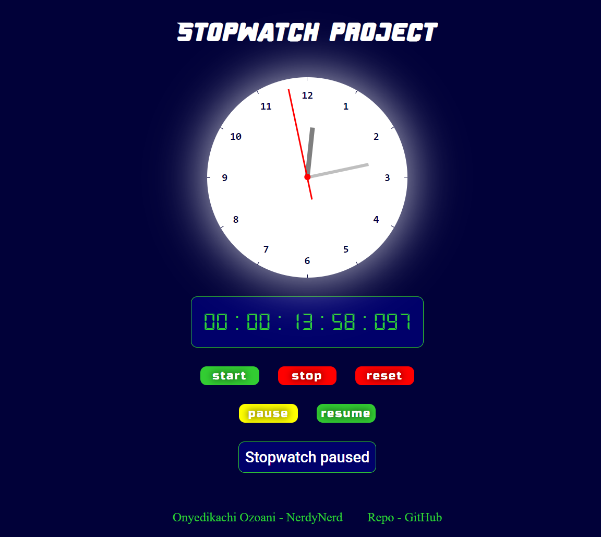

<!-- @format -->

# NerdyNerd - Stopwatch timer with both digital and analog clock interfaces

- [NerdyNerd - Stopwatch timer with both digital and analog clock interfaces](#nerdynerd---stopwatch-timer-with-both-digital-and-analog-clock-interfaces)
	- [Overview](#overview)
		- [Project description](#project-description)
		- [Screenshot](#screenshot)
		- [Links](#links)
	- [My process](#my-process)
		- [Built with](#built-with)
		- [What I learned](#what-i-learned)
	- [Author](#author)
	- [Acknowledgement](#acknowledgement)

## Overview

### Project description

This is a Stopwatch timer project built with two interfaces - digital and analog, for an intriguing user experience.

### Screenshot

-   

### Links

-   Live site URL - [https://stopwatch-nerdynerd.netlify.app/](https://stopwatch-nerdynerd.netlify.app/)

## My process

### Built with

-   Semantic HTML5 markup
-   CSS Transformations
    -   `transform: translate();`
    -   `transform: rotate();`
    -   `transform-origin: top right;`
-   OOP in JavaScript
    -   **SOLID principles**
    -   **classes** and **objects**
-   Performance reliant animations - `requestAnimationFrame(callback);`

### What I learned

-   Prototyping and inheritance of classes in JavaScript
-   Using **SOLID principles**
-   Using `requestAnimationFrame()` window method to create animation loops
-   Using CSS transformations to create a circular clock interface - Math for the positioning of ticks and hour numbers in the circular clock
    -   

## Author

-   LinkedIn - [@onyedikachi23](https://www.linkedin.com/in/onyedikachi23)
-   Frontend Mentor - [@OnyedikachiOzoani](https://www.frontendmentor.io/profile/OnyedikachiOzoani)

## Acknowledgement

All thanks to [MDN Web Docs](https://developer.mozilla.org/en-US/) and [Stack Overflow](https://stackoverflow.com/) for being helpful throughout the development of this project.

**_Thanks for viewing my project!_**
